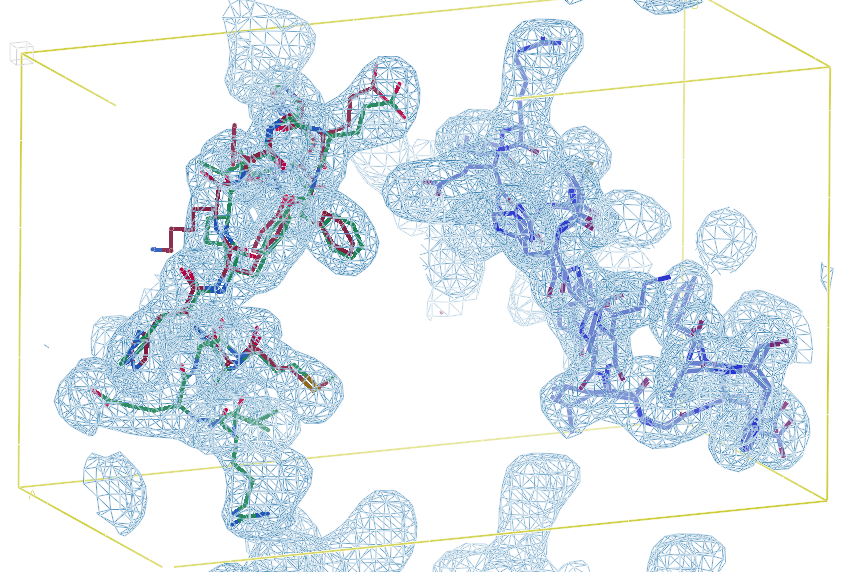

# Completion of Partial Structure Templates with Patterson Maps using the CrysFormer Model Architecture

Protein structure determination has long been one of the primary challenges of structural biology, to which deep machine learning-based approaches have increasingly been applied.
However, these ML models generally do not incorporate the experimental measurements directly, such as X-ray crystallographic diffraction data. 
To this end, we explore an approach that more tightly couples these traditional crystallographic and recent ML-based methods, by training a hybrid 3-d vision transformer and convolutional network on inputs from both domains.
We make use of Patterson maps, constructs that are directly obtainable directly from crystallographic data through a Fourier transform, and predicted structures taken from the AlphaFold Protein Structure Database with randomly omitted residues, creating “partial structure” template maps, to predict electron density maps that are then post-processed into atomic models through standard crystallographic refinement processes.
Introducing an initial dataset of small protein fragments taken from Protein Data Bank entries and placing them in hypothetical crystal settings, we demonstrate that our method is effective at both improving the phases of the crystallographic structure factors, and completing the regions missing from partial structure templates as well as improving the agreement of the electron density maps with the ground truth atomic structures.

  

## Dataset Generation
In the ground_truth directory, extract the files from (https://doi.org/10.5281/zenodo.15498745) into the 2_pdb directory.  
Then run the step3_mpi.sh, step4_mpi.sh,..., step9_mpi.sh scripts (4/5, 6/7, and 8/9 can be run in parallel). 
Steps 3, 4, and 5 require that the ccp4 program suite is installed (https://www.ccp4.ac.uk/); source the path to the installed version of ccp4 in the third line in each of these scripts.
This will populate the patterson_scaled and electron_density_scaled directories.
Similarly, in the partial_structure directory, extract the files from into 2_pdb, and then run the scripts for steps 3, 5, 7, and 9 to populate the ps_alphafold_randdrop directory.
These fragments are derived from entries in the AlphaFold Protein Structure Database, used under [CC BY 4.0](https://creativecommons.org/licenses/by/4.0/) / extracted, residues renumbered, B-factors and aligned to ground truth fragments.

## Dependencies
torch version >= 2.3.1

einops version >= 0.8.1

https://github.com/facebookresearch/schedule_free

https://github.com/wimmerth/scale-equivariant-3d-convnet as scale_equivariant_3d_convnet

## Training
Run train_ddp.py, setting the default value for the "world_size" argument on line 388 equal to the number of available gpus. 
After each training epoch, a model state checkpoint is saved to state.pth, and a line with multiple columns is displayed.
These columns report:
1. Current training epoch (0-indexed)
2. Average training set loss
3. Average Pearson correlation across test set between model predictions and ground truth maps
4. Average Pearson correlation across test set between input Patterson maps and Patterson maps derived from corresponding predictions
5. Average Pearson correlation across test set after applying a Fourier transform to both the model prediction and ground truth and then taking the amplitudes of all elements in the resulting complex tensors
6. Most recent learning rate of OneCycle scheduler
